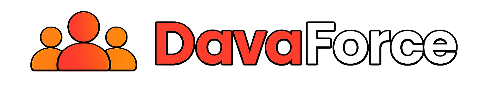

<div align="center">

</div>

# DavaForce

This folder is the active combined project.

It keeps frontend and backend ownership separate while running on one Next.js server.

```text
davaforce/
  frontend/   UI pages, components, hooks, frontend utilities, source assets
  backend/    API contracts, route handlers, import/verify logic, Mastra, scripts
  src/app/    small Next.js bridge that connects frontend pages and backend APIs
  package.json
```

Run locally:

```powershell
npm install
npm run dev
```

Build:

```powershell
npm run build
```

The same server exposes frontend routes such as `/`, `/ask`, `/workspace`, and `/dashboard`, plus API routes such as `/api/auth/login` and `/api/workforce-datasets`.

For team ownership rules and examples, see `docs/team-structure.md`.
