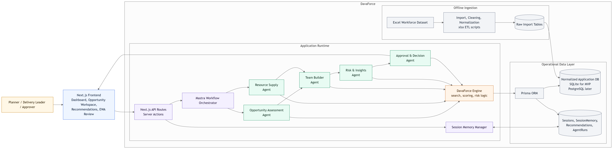
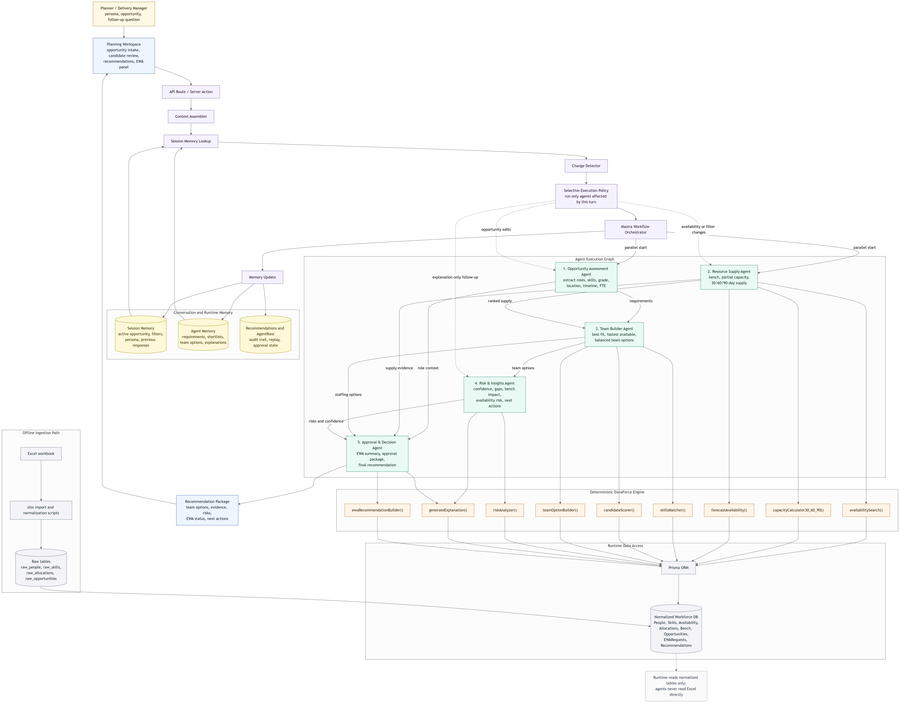
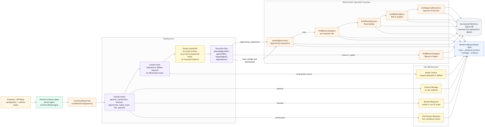
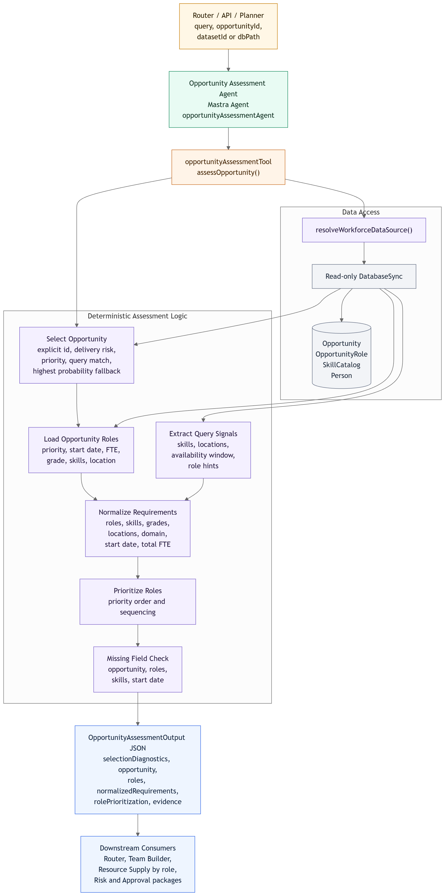
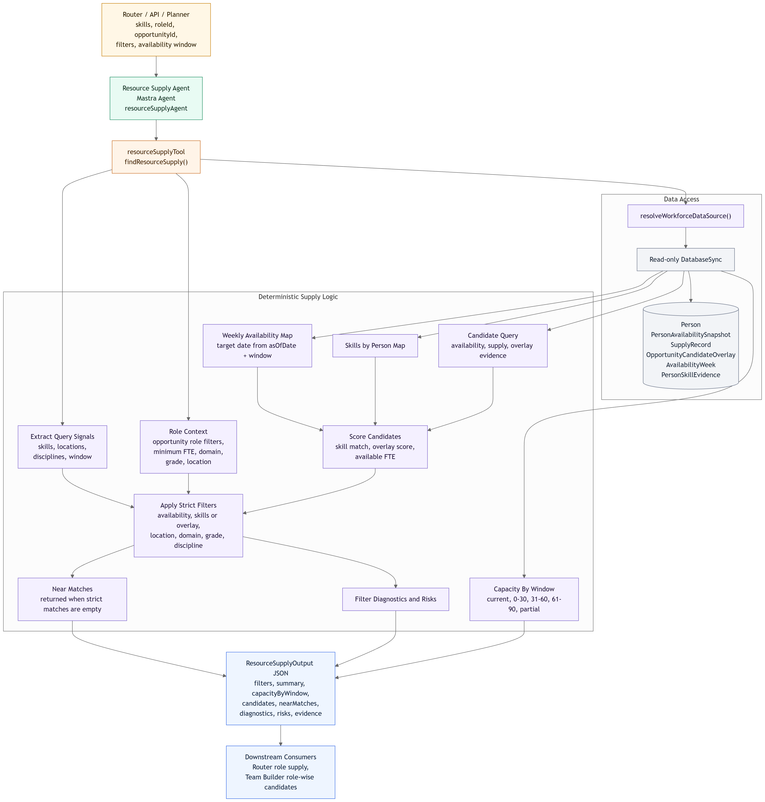
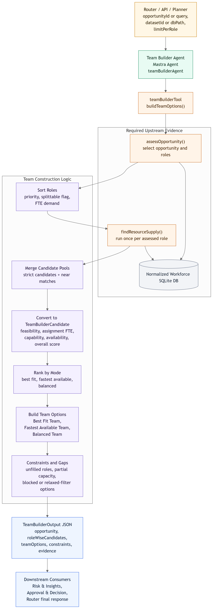
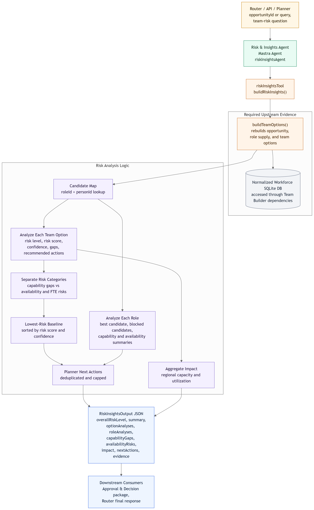
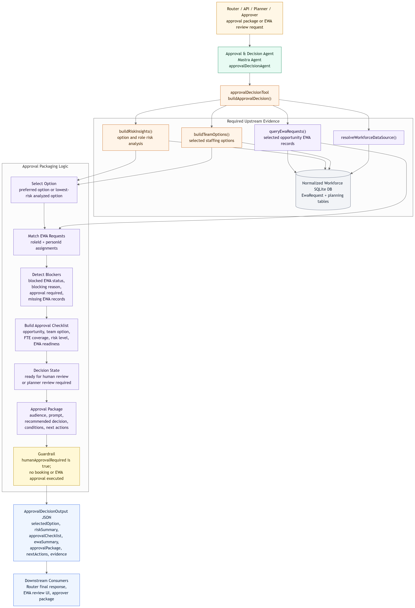

# Docs Guide

This folder is the documentation hub for DavaForce. It captures the product requirements, MVP architecture, API and agent contracts, team ownership boundaries, and the reference material used to keep workforce-planning behavior consistent.

## What this folder covers

- product scope and MVP expectations
- architecture and system flow
- API contracts and dashboard data requirements
- workforce agent contracts and agent-tool usage
- team structure and code ownership guidance

## Folder map

- `requirements.md`
  Core product requirements, target users, objectives, and functional scope for DavaForce.
- `mvp.md`
  MVP architecture overview covering the platform shape, data pipeline, and runtime model.
- `static-dashboard-api-requirements.md`
  Backend requirements for the static dashboard endpoints, dataset snapshot flow, raw Excel preview, and workbook download.
- `team-structure.md`
  Ownership guide for `frontend/`, `backend/`, `src/app/`, `public/`, and `docs/`.
- `contracts/`
  HTTP API contract documentation. Start with `contracts/api-contracts.md`.
- `agent-tools/`
  Reference docs for the deterministic workforce planning tools. Start with `agent-tools/README.md`.
- `agent-contracts/`
  JSON response contracts for the routed workforce agents such as opportunity assessment, resource supply, team building, risk insights, and approval decisions.
- `architecture_diagrams/`
  Mermaid source files plus PNG exports for system-level and agent-level architecture diagrams.

## Architecture diagrams

### High-level architecture

### Low-level architecture

## Agent diagrams

### Workforce router agent

### Opportunity assessment agent

### Resource supply agent

### Team builder agent

### Risk insights agent

### Approval decision agent

## Suggested reading order

1. `requirements.md` for product intent and scope.
2. `mvp.md` for the current architecture and data flow.
3. `team-structure.md` for repo ownership and folder responsibilities.
4. `contracts/api-contracts.md` for HTTP behavior.
5. `agent-tools/README.md` and `agent-contracts/` when working on workforce agent logic.

## When to update this folder

Update these docs when product scope changes, API behavior changes, agent output contracts change, or architecture decisions shift. The docs should stay aligned with the implemented system rather than act as separate notes.
